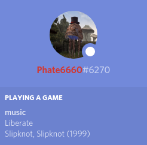

# MPD Discord RPC

Displays your currently playing:

song
artist, album (date) 

From MPD in Discord using Rich Presence. It includes support for multiple MPD hosts if, like me, you have more than one server you alternate between.

The program does not require MPD or Discord to be running in order to run.

Once installed just run `mpd-discord-rpc`.



## Installation

```
git clone https://github.com/Phate6660/mpd-discord-rpc
cd mpd-discord-rpc
cargo install --path .
```

## Configuration

Running the program once will generate a default configuration file. On Linux this will be at `~/.config/discord-rpc/config.toml`

- **id** - The Discord application ID to run through. 
- **hosts** - An array of MPD server host socket addresses. Each one will be tried in order until a playing server isfound.

## Thanks

THANK YOU JakeStanger! Before I was using a \<disgusted noise\> NodeJS-based discordrpc for MPD.

Now I can finally use one written in my favorite language.

And since it was fairly easy to read through and edit (thanks for the comments), I was able to adjust the output to my preferences.
